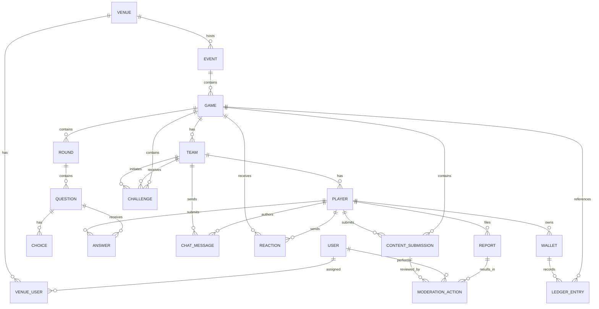
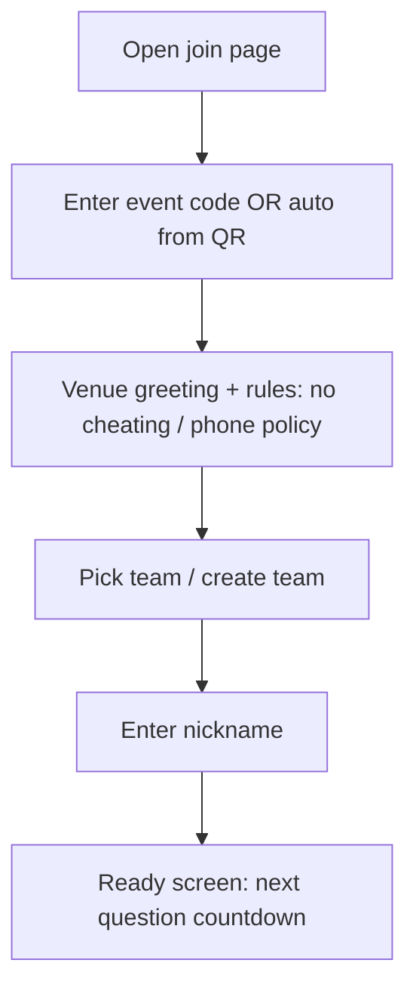
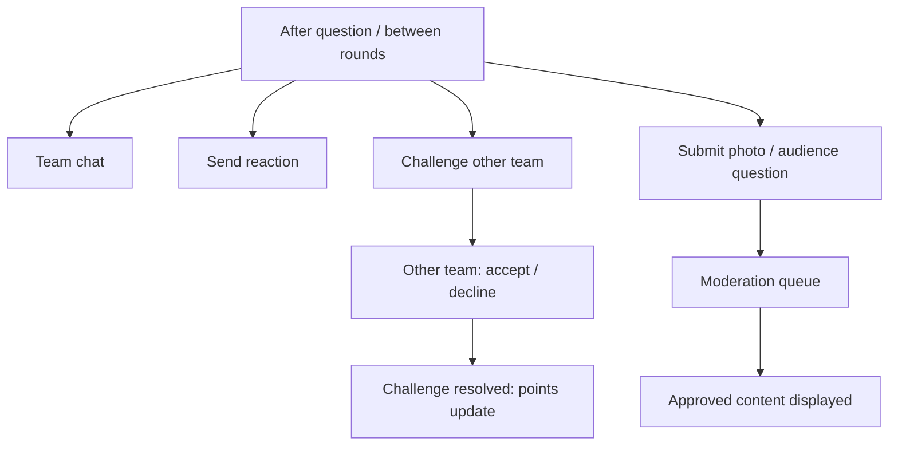

# Audience-to-Audience Pub Trivia Platform Competitive Blueprint

## Executive summary

Pub (and bar) trivia is a durable social ritual with recurring participation: a 2023 Greene King survey reported **70%** of people *regularly* take part in pub quizzes and **8%** attend weekly, emphasizing both scale and habit-forming potential. citeturn4search1 At the same time, modern trivia nights face a widely discussed trust issue: smartphone/smartwatch cheating and music-identification apps can undermine perceived fairness, harming attendance and long-term retention if venues and hosts cannot credibly enforce integrity. citeturn4search2turn4news38

**Competitive baseline.** CrowdPurr is a strong “host-to-audience” trivia engine: QR/URL join, team play modes, timers, live leaderboards, and multi-round cumulative scoring—optimized for events and broadly applicable beyond pubs. citeturn0search0turn0search31turn2search5 It also includes a moderated Social Wall capable of audience posts (including photos) through a web experience-code flow, which is the closest existing CrowdPurr primitive to audience-to-audience interaction. citeturn3search1turn3search0 However, CrowdPurr’s core product surface is not primarily designed to **stimulate interaction between tables/teams** (e.g., team chat, cross-team challenges, in-venue matchmaking), which creates a defensible differentiation corridor for pub/team trivia.

**Differentiator thesis (what “audience-to-audience” means operationally).** In a pub, people already talk within their table; the untapped opportunity is **structured interactions across tables** that are (a) fast, (b) low-moderation-cost, (c) venue-friendly, and (d) measurable. This includes: lightweight team formation, table-to-table challenges, controlled point-based side-bets, live reactions, audience-sourced questions, photo/video rounds with in-venue prompts, and “social layers” (profiles, rivalries, badges) that carry across weeks.

**Recommended product strategy.** Build a web-first (PWA-capable) platform with QR join and ultra-fast onboarding (CrowdPurr’s strongest adoption pattern), while adding an interaction layer that keeps phones in-hand for *play* but constrains cheating through timers, anti-collusion heuristics, and host tools—similar in spirit to time-limited formats cited as a response to cheating concerns. citeturn0search0turn4search2

**MVP scope recommendation.** A credible MVP for pubs should include: (1) QR join + team creation, (2) mobile answer UI + projector view, (3) one cross-team interaction mechanic (e.g., “table challenge cards”), (4) team chat scoped to the session (optionally table-only at MVP), and (5) moderation/reporting foundations to satisfy app distribution and safety norms if you later ship native wrappers. citeturn8search0turn8search1

**Commercial posture.** The venue buyer (not the player) is typically the primary customer. This matches competitor patterns: Buzztime sells a bar subscription (example: $199/month advertised) and emphasizes in-venue competitions and engagement. citeturn10search1 CrowdPurr sells per-month SaaS plans (e.g., $49.99+ tiers) and monetizes sponsor/logo ad surfaces. citeturn2search2turn2search29 A pub-centric competitor can combine venue subscription + optional sponsor packages + “season” features for retention.

Unspecified, and therefore treated as **assumptions** throughout: target geography/jurisdictions, target venue size mix (small pubs vs large bars), whether you will distribute via app stores vs purely web, and whether prizes involve money/value beyond “points.” (These materially affect legal/compliance and go-to-market.)

## Competitive landscape

### What CrowdPurr already does well (and why it matters)

CrowdPurr provides a mature trivia control loop: web-based hosting; multiple trivia formats (points timer, survivor, percentage); team modes; multi-round cumulative scoring; real-time leaderboard; media questions (images/GIFs); and spreadsheet import/export paths. citeturn0search0turn0search31turn2search3turn3search26 It supports multiple playback modes (host-controlled, fully automatic, and “crowd controlled” self-paced) that map to different event rhythms. citeturn2search5turn2search30 Host tooling includes a dashboard for controlling question progression and exporting participant/answer/ranking data. citeturn0search0turn0search36

CrowdPurr’s Social Wall adds moderated audience posting (including via a web “experience code” flow), with explicit support for pre-approval and profanity filtering—important evidence that UGC can be supported, but also that **moderation is non-optional** operationally. citeturn3search1turn3search0

### Competitors selected for comparison (plus why they matter)

The three additional competitors below are chosen because they represent **distinct archetypes** relevant to pub trivia:

* **Dedicated pub-trivia app with local-network orientation**: entity["company","SpeedQuizzing","smartphone pub quiz platform"] uses phone/tablet inputs; Apple’s store description emphasizes team play connected over a local Wi‑Fi network, aligning with venue realities and low-connectivity resilience. citeturn0search10turn0search21  
* **Venue subscription network**: entity["company","Buzztime","bar trivia and games network"] markets itself as bar trivia/games “made specifically for bars and restaurants,” offers a bar subscription price point, and emphasizes in-venue gameplay and leaderboards. citeturn1search0turn10search1turn1search3  
* **General-purpose live quiz platform**: entity["company","Kahoot!","game-based learning platform"] has team mode mechanics (team selection and host reassignment) and anti-abuse onboarding patterns (nickname generator), which translate to pub flows even if pubs aren’t its core market. citeturn1search1turn1search13turn1search25  

### Feature and positioning comparison

image_group{"layout":"carousel","aspect_ratio":"16:9","query":["pub trivia night crowd phones","people scanning QR code at bar","CrowdPurr trivia leaderboard projector view","SpeedQuizzing app screenshot keypad buzzer"],"num_per_query":1}

#### Competitive matrix (selected high-signal capabilities)

| Dimension | CrowdPurr | SpeedQuizzing | Buzztime | Kahoot! |
|---|---|---|---|---|
| Join flow | QR/URL web join (no app required implied by “web-based participant view”) citeturn0search0 | Mobile app install, often used in venue settings citeturn0search10turn10search4 | Mobile app for in-venue gameplay citeturn1search3turn1search28 | Join via code; team mode allows team selection citeturn1search1 |
| Pub/team orientation | Team trivia modes exist; not pub-specialized citeturn0search31turn2search3 | Explicitly positioned as smartphone pub quiz; team play emphasized citeturn0search10turn0search2 | Explicitly bar/restaurant-focused network citeturn1search0turn10search1 | Broad use across school/work/home citeturn1search25 |
| Live leaderboard | Real-time rankings leaderboard citeturn0search0turn0search19 | Scoreboard mode exists (host tooling) citeturn0search14 | Local + network leaderboards referenced citeturn1search3turn1search12 | Classic leaderboard; reports and analytics citeturn1search17 |
| Media rounds | Image/GIF questions and answer images/GIFs citeturn0search0turn3search26 | Hosts can add picture/music questions (documentation) citeturn0search17 | Not specified in accessible sources reviewed | Supports varied question styles; not pub-specific in sources reviewed citeturn1search25 |
| Audience-to-audience primitives | Social Wall posts (moderated), but not session chat/rivalry as a first-class layer citeturn3search1turn3search0 | Not specified (focus is buzzer/inputs) citeturn0search10 | “Bar buddies”/leaderboards + prizes language; not explicit social mechanics in sources reviewed citeturn1search3turn1search12 | Team mode supports team selection; not built for cross-table social play in sources reviewed citeturn1search1 |
| Monetization signals | Sponsor/ad surfaces + plan tiers citeturn2search2turn2search29 | Host charges nominal player fee often; host activations priced per event citeturn10search4turn10search20 | Bar subscription marketed (e.g., $199/month) citeturn10search1turn10search5 | Subscription plans; participant caps vary by plan citeturn10search14turn10search22 |

### Strengths, weaknesses, and feature gaps to exploit

**CrowdPurr**
* Strengths: mature host dashboard + playback modes; team trivia; multi-round; exports; moderated Social Walls; field-proven QR join flow and projector presentation view. citeturn0search0turn2search5turn3search1turn0search36  
* Weaknesses (pub-specific): audience-to-audience interaction is not obviously a core loop beyond Social Wall posting; pub operations (season play, venue loyalty, table matchmaking) are not foregrounded in docs reviewed. citeturn3search1turn0search0  
* Gaps to exploit: persistent pub “seasons,” cross-team challenge system, in-venue social graph, structured rivalry, session chat controls, and per-venue retention tooling (not evidenced as first-class in reviewed sources).

**SpeedQuizzing**
* Strengths: venue-centric orientation; local Wi‑Fi framing suggests resilience and lower dependence on internet; optional live-screen use indicates flexibility for venues with TVs/projectors. citeturn0search10turn0search2  
* Weaknesses: app download friction (especially for casual walk-ins); event activation model and per-event licensing may be operational overhead for some venues. citeturn10search20turn10search28  
* Gaps to exploit: web-first join with no install while still supporting “fast buzzer” rounds; richer audience-to-audience interactions beyond teams.

**Buzztime**
* Strengths: bar subscription framing and network-level leaderboards/prizes; designed specifically for bars/restaurants; app supports “play at a Buzztime location” and leaderboard bragging language. citeturn10search1turn1search3turn1search12  
* Weaknesses: product emphasis appears network/content-driven; sources reviewed don’t evidence deep cross-table social mechanics (e.g., controlled chat, matchmaking, audience-created rounds). citeturn1search3turn10search1  
* Gaps to exploit: “social layer” and venue community features not just network trivia; lightweight UGC rounds and table-to-table interactions.

**Kahoot!**
* Strengths: polished onboarding patterns (e.g., nickname generator to reduce inappropriate names and speed join); team mode with team selection and host control; robust reporting. citeturn1search13turn1search1turn1search17  
* Weaknesses: positioned as a learning/engagement platform for school/work/home; not optimized for pub constraints (low light, noise, intermittent connectivity, repeated weekly seasons). citeturn1search25turn6search2  
* Gaps to exploit: pub-specific UX and operations, venue/host workflows, and cross-table engagement mechanics.

## Product requirements and prioritized feature set

### Design principles for “audience-to-audience” pub trivia

A pub trivia system that truly increases **repeat visits** must (a) reduce time-to-join, (b) create cross-table “moments,” and (c) preserve fairness. QR join + browser-based participant view is a proven pattern in CrowdPurr’s model for fast entry. citeturn0search0 Cheating concerns are salient enough to reduce attendance; therefore, the social layer must not undermine integrity. citeturn4search2turn4news38 Finally, if you introduce chat, profiles, photos, or audience-sourced content, you should treat UGC moderation as a first-class system requirement (see app store requirements and UGC policies). citeturn8search0turn8search1

### Interaction-first feature backlog (prioritized)

Importance ranking: **1 (highest)** to **5 (lowest)**. Development complexity: **Low / Medium / High** (relative to a greenfield build).

| Feature | Rationale | Implementation notes | Complexity | Importance |
|---|---|---:|---:|---:|
| Session-scoped team chat (team-only) | Creates intra-team coordination and shared “banter” without changing pub culture; bounded scope reduces safety risk. | WebSockets for messages; ephemeral retention; profanity filter; host “mute team” switch. Use “message rate caps” to prevent spam. citeturn6search0turn3search4 | Medium | 1 |
| Table-to-table challenges (“challenge cards”) | Converts passive coexistence into structured cross-table interaction with clear rules. | Post-question prompt: “Challenge a nearby table to double-or-nothing points next question.” Provide accept/decline; auto-expire if no response. | Medium | 1 |
| Live reactions (emoji bursts, applause) | Low-effort cross-audience expression; creates “momentum” in a loud environment. | Predefined reaction set; throttle per device; aggregate to projector as counts/heatmap. | Low | 1 |
| Team formation UX: create team + join by code + pick table number | Team formation is the gateway to audience-to-audience features; must be fast. | Default to “table number + fun name” pattern; optional auto-generated names similar to existing practices. citeturn3search8turn1search13 | Medium | 1 |
| In-venue matchmaking (“looking for team”) | Helps solo/duo patrons participate; increases inclusivity and fill rates. | “Open seats” toggle for teams; QR join shows “Join open team?” list; host override. | High | 2 |
| Cross-team “rivalry” pairing (rematch prompt) | Drives return visits by creating recurring opponents. | After game: “Request rematch next week”; store venue+team pairing; notify via QR link/optional push. citeturn6search3turn6search2 | Medium | 2 |
| Audience-sourced question submission (for future rounds) | Builds community ownership; creates a participatory loop beyond play. | Submission form with category + answer + explanation; queue for host review; attribution badges. Must include review + reject/edit. citeturn3search0turn3search13 | High | 2 |
| Photo rounds (with prompt, optional “proof” selfies) | Pub-friendly, high-energy interaction; also differentiates from classic multiple choice. | Photo upload requires UGC pipeline + moderation queue; show only after approval; rate-limit uploads. citeturn3search1turn8search0turn8search1 | High | 2 |
| “Social wall inside the game” (curated highlights) | Social proof + shared laughs; “why did they post that?” moments. | Host-curated carousel of approved posts; auto-expire after event; exportable for venue marketing if consented. citeturn3search1turn3search19 | High | 3 |
| Point-based side-bets (no money) | Adds strategic tension without gambling cash; CrowdPurr already frames point wagering as “not real money.” citeturn10search3 | Use virtual “chips” awarded weekly; bet only on in-game outcomes; show audit trail to host. Hard rule: no real-money payouts unless jurisdictional compliance is solved. | High | 3 |
| Cross-team mini-games between rounds | Keeps engagement during scoring/host banter; creates hallway interaction. | Two-minute micro-round: “closest answer wins,” “caption contest,” “vote a meme.” Needs moderation if free-text. citeturn3search4 | Medium | 3 |
| Persistent player profiles (venue-scoped) | Increases retention via identity and progress across weeks. | Minimal profile: nickname + optional avatar; default private; avoid collecting emails unless needed. Map to device+optional account. citeturn3search8turn5search3 | High | 3 |
| Friend/foe graph (venue-scoped) | Encourages “bring friends” behavior; powers matchmaking and rivalries. | Opt-in “add as friend” via QR scan; block/report mechanics required. citeturn8search1turn8search0 | High | 4 |
| Cross-venue leaderboards (opt-in) | Viral loop for a multi-venue operator; motivates exploration. | Ranking partitions by city/operator; anti-smurfing; requires account identity. | High | 4 |
| Direct messages | Adds richness but sharply increases moderation and safety burden in pubs. | Avoid in MVP; if added, require block/report, abuse detection, and tighter rate limits to meet UGC safety expectations. citeturn8search25turn8search1 | High | 5 |

### Core platform feature backlog (comprehensive, but pub-optimized)

| Feature area and item | Rationale | Implementation notes | Complexity | Importance |
|---|---|---:|---:|---:|
| QR + short code join | Fast onboarding is decisive for casual pub patrons; competitor pattern. citeturn0search0 | Multi-join paths: QR, short URL, numeric pin. Auto-detect captive portals; show “offline mode” hints. | Medium | 1 |
| Host dashboard (start/pause/next/back, show leaderboard) | Live host control is the pub norm; aligns with host-controlled paradigms. citeturn0search13turn2search9 | One-screen “control center” with keyboard shortcuts; “panic button” to freeze submissions. | Medium | 1 |
| Projector/TV presentation view | A shared screen is the social anchor; CrowdPurr uses this model. citeturn0search19turn0search0 | Separate “display-only” view; large typography; low-latency updates; offline fallback to last state. | Medium | 1 |
| Trivia formats: timed multiple choice + text answer | Covers the bulk of pub rounds; text answers enable creative rounds but require moderation. citeturn3search4turn3search20 | Text answers: allow multiple correct variants; add fuzzy matching; require review for display. citeturn3search20turn3search4 | High | 1 |
| Team mode variants (single device per team vs per-player contributions) | Pubs differ: some want one “captain device”; others want everyone answering. CrowdPurr supports “team leader” in basic team mode. citeturn0search31 | Support both: “Captain submits” and “Consensus” (agg answers). Consensus requires anti-spam and per-question lock rules. | High | 1 |
| Anti-cheat toolkit (timers, device rules, anomaly detection) | Cheating is salient and can reduce repeat attendance. citeturn4search2turn4news38 | Short answer windows; disallow answer changes after reveal; flag improbable response times; optional “phones down” pause reminders. | High | 1 |
| Media rounds (image/GIF/video/audio) | Pub trivia commonly uses picture/music rounds; CrowdPurr supports images/GIFs and YouTube media in its ecosystem. citeturn0search0turn2search8turn3search26 | Optimize file sizes; prefetch media; provide “audio sync test” mode for venues. | Medium | 2 |
| Multi-round cumulative scoring (“season-lite”) | Multi-round increases dwell time; cumulative scoring supports league behavior. citeturn0search0turn2search3 | Allow “rounds” in a single night and “season” across weeks; clear reset controls. | High | 2 |
| Exports + API for results | Venues and hosts want records, disputes resolution, sponsor reporting. CrowdPurr exports to CSV/spreadsheets. citeturn0search0turn0search36turn3search19 | CSV export; webhook events; later: public API. Consider privacy for personal data fields. citeturn5search3 | Medium | 2 |
| Sponsor surfaces (post-answer banner, projector sponsor slides) | Pub trivia is often sponsored; CrowdPurr monetizes ads/sponsor logos. citeturn2search29turn2search2 | Offer sponsor slots per venue + impression counts; ensure “sponsor assets” are cached locally. | Medium | 2 |
| Integrations: Google Sheets/Excel import | Hosts often build quizzes in spreadsheets; CrowdPurr supports spreadsheet import. citeturn0search0turn3search17 | Define import schema; validate media links; provide preview and “lint” errors. | Medium | 2 |
| Notifications (venue reminders) | Drives repeat attendance; CrowdPurr supports SMS/email via VIP lists. citeturn3search3turn3search5 | For pubs: prefer opt-in push or email; SMS is costly and regulated. If web push, iOS requires home-screen web app. citeturn6search3turn6search6 | High | 3 |
| Accessibility defaults (touch targets, contrast, typography) | Pub environment: dim lighting + one-handed use + motion; accessibility improves speed and reduces errors. WCAG 2.2 adds target-size guidance. citeturn7search0turn7search4 | Follow minimum target sizes (24×24 CSS px) and aim larger; Apple recommends 44×44pt for buttons. citeturn7search0turn7search2 | Medium | 2 |
| Offline/low-connectivity mode | Guest Wi‑Fi is variable; some competitors emphasize local Wi‑Fi play. citeturn0search10turn9search1 | Service worker caching + queued submissions; background sync where supported; “local relay mode” (optional) for critical venues. citeturn6search2turn6search19 | High | 2 |
| Security baseline (rate limits, authZ, logging) | Real-time + UGC increases abuse surface; OWASP Top 10 highlights access control and misconfiguration as major risks. citeturn8search2turn8search10 | Separate roles: venue owner, host, moderator; least privilege; audit logs; DDoS protection; secure defaults. | High | 1 |
| Moderation tooling (report/block, host review queues) | Required for UGC distribution norms and safety expectations. Apple and Google explicitly require moderation/reporting/blocking for UGC. citeturn8search0turn8search1 | In-app report/block; host queue; escalation SLAs; transparency log. Avoid dark patterns in reporting flows. citeturn11news44 | High | 1 |

## Technical architecture, scalability, latency, and device support

### Architecture options (web vs native) with ranked recommendations

| Option | Rationale | Implementation notes | Complexity | Importance |
|---|---|---:|---:|---:|
| Web-first responsive app (PWA-capable) | Lowest friction: QR join in browser mirrors best-in-class event trivia patterns. citeturn0search0 | One codebase; “participant,” “host,” and “screen” modes. Add PWA install prompts. iOS web push is supported for home-screen web apps in iOS 16.4+ and Safari 16+ on macOS. citeturn6search3turn6search6 | Medium | 1 |
| Hybrid wrapper (web app inside native shell) | Enables app store distribution without full native rebuild; helps with push + device permissions. | Use Capacitor/React Native WebView; keep core UI web-based; still must meet UGC moderation requirements if UGC exists. citeturn8search0turn8search1 | High | 3 |
| Full native participant apps (iOS/Android) + web host | Best if you need ultra-low latency, deep device capture, or offline guarantees. | Requires two client codebases + shared backend; heavier QA. WebSockets still used for real-time. citeturn6search0 | High | 4 |
| On-prem “local server” appliance mode | Maximizes resilience if internet fails mid-quiz. | Mini-PC or host laptop runs local server; sync to cloud later. Operationally complex for venues. | High | 5 |

### Real-time transport and latency considerations

Pub trivia needs “feels instant” feedback for leaderboards, reactions, and challenge acceptances. WebSockets are the most natural fit for interactive, bi-directional real-time play: MDN describes the WebSocket API as enabling a two-way interactive session without polling overhead. citeturn6search0 For display-only screens where the server only pushes updates, server-sent events (SSE) can be a simpler one-way streaming option, but it is not sufficient alone when clients must send interactions continuously. citeturn6search1turn6search14

**Recommended pattern (practical):**
* Participant view: WebSocket (bi-directional gameplay + chat + challenges). citeturn6search0  
* Projector view: SSE or WebSocket (SSE is adequate if projector never sends). citeturn6search1  
* Admin dashboard: WebSocket for live control and monitoring.

### Scalability model: from one pub to many venues

CrowdPurr positions itself as cloud-based trivia for “thousands” and documents plans supporting 5,000 participants per experience (with higher capacity available by arrangement), which provides a useful benchmark that large-crowd scaling is feasible in this category. citeturn0search0turn2search29 Pub use cases typically have smaller per-room concurrency, but **multi-venue concurrency** (many pubs running simultaneously) creates similar backend demands.

**Recommended scalable backend shape (cloud-agnostic):**
* **Game room shard key**: `game_id` (or `venue_id + scheduled_event_id`).  
* **State store**: in-memory cache for “hot” game state + durable DB for persistence and audit.  
* **Pub/sub**: to fan out updates to connected sockets; keep payloads small and incremental (diff-based).  
* **Idempotent writes**: answer submissions and challenge accepts must be idempotent to handle retries during poor connectivity. This is especially important if you adopt offline queueing. citeturn6search2turn6search19  

### Offline and low-connectivity support (venue reality)

Service workers are a core PWA mechanism enabling offline access and background behavior; MDN describes background sync as deferring tasks until connectivity returns, which is relevant for queued answer submissions or uploads. citeturn6search2turn6search19 Given that iOS support can differ from desktop/Android, treat offline enhancements as opportunistic rather than required for baseline gameplay. citeturn6search15turn6search16

**Recommended “degrade gracefully” approach:**
* Cache the shell UI + current question payload locally.
* If connectivity drops, allow drafting answers locally; attempt submit when online; show “submitted/pending” states.
* Provide host-facing “connectivity health” indicators per team (e.g., last ping).
* For photo rounds, require stable connectivity and allow host to disable them per venue.

### Device support goals for pub use (phones and tablets)

Competitors show the expected device surface:
* CrowdPurr describes participant view as cross-device across phones, tablets, laptops, and desktops. citeturn0search0  
* SpeedQuizzing’s app store description explicitly calls out iPhone/iPad use and local Wi‑Fi connection. citeturn0search10  
* Buzztime states its trivia app supports iOS and Android devices. citeturn1search3turn1search28  

Your platform should assume: iOS Safari/Chrome (WebKit), Android Chrome, and a “big screen” browser (Chromium-based preferred). If you later distribute in app stores, comply with UGC and privacy expectations early. citeturn8search0turn8search1turn5search10

### UX/UI patterns for quick pub use (evidence-based heuristics)

In a pub, UX must minimize precision tapping and reading strain. WCAG 2.2’s Target Size (Minimum) guidance sets a baseline that pointer targets should be at least 24×24 CSS pixels (with exceptions), and Apple’s HIG recommends a 44×44pt hit region for buttons. citeturn7search0turn7search2 Nielsen Norman Group similarly argues for adequately sized touch targets to reduce errors on touchscreens. citeturn7search3

**Recommended pub-specific UI conventions (derived from these guidelines and venue constraints):**
* Default to single-column layouts; large tap areas; avoid dense grids. citeturn7search3turn7search2  
* High contrast and large text to support dim lighting; WCAG contrast criteria exist specifically to keep text readable for low vision and contrast impairment. citeturn7search1turn7search24  
* Reduce typing: favor prefilled team name suggestions and optional auto-generated nicknames (a pattern explicitly positioned as reducing “naughty names” and speeding join in Kahoot). citeturn1search13  
* “One action per screen”: Answer → Confirm → Done; surface progress clearly; avoid hidden navigation.
* Host tools: large “Next question / Lock answers / Show leaderboard” controls with keyboard shortcuts for speed (CrowdPurr demonstrates host shortcut patterns in its help docs). citeturn0search13  

### Suggested data model (with ER diagram)

A pub trivia + social interaction platform requires both gameplay entities and social/moderation entities. Below is a suggested relational model (you can implement in SQL, or adapt to document/event sourcing).



### Core UI flow diagrams (mermaid)

#### Team creation

```mermaid
flowchart TD
  A[Scan QR / enter short code] --> B[Select: Join existing team or Create team]
  B -->|Create| C[Enter table number + team name]
  C --> D[Choose mode: Captain device or Everyone answers]
  D --> E[Confirm + Join lobby]
  E --> F[Optional: Enable "Looking for teammates"]
```

#### Joining a game



#### Answering flow

```mermaid
flowchart TD
  A[Question displayed] --> B[Answer options / input]
  B --> C[Confirm submission]
  C --> D[Lock state + show "pending results"]
  D --> E[Reveal correct answer + points change]
  E --> F[Post-question: reactions + optional challenge prompt]
```

#### Social interactions flow



## Moderation, safety, and legal/compliance

### Moderation and safety requirements (especially for chat/UGC)

If you ship any UGC (chat, photos, public posts), moderation and user controls are not optional in modern distribution environments. Apple’s App Store Review Guidelines explicitly reference requirements for moderating UGC. citeturn8search0turn8search25 Google Play requires “in-app system for reporting and blocking objectionable UGC and users” and reasonable moderation consistent with the UGC type. citeturn8search1turn8search5

| Safety item | Rationale | Implementation notes | Complexity | Importance |
|---|---|---:|---:|---:|
| In-app report + block (users and content) | Required by Google Play UGC policy and aligned with Apple UGC expectations. citeturn8search1turn8search0 | Provide report categories; immediate local block; host/mod tooling for action logs. | Medium | 1 |
| Host moderation console (queues, approvals, mutes) | CrowdPurr shows pre-approval patterns for social posts and profanity review settings. citeturn3search0turn3search1turn3search4 | Unified queue for chat flags, photo submissions, audience questions; bulk actions; “slow mode” toggles. | High | 1 |
| Automated profanity filtering + manual review modes | Reduces host workload; protects venue environment. CrowdPurr supports auto-review profanity filtering and manual review. citeturn3search0turn3search4 | Use wordlists + ML classifier optional; allow venue-level strictness; maintain auditability. | Medium | 2 |
| Rate limiting + abuse detection | Prevents spam floods and denial-of-experience. OWASP highlights insecure design and auth failures as common risks. citeturn8search2 | Per-IP and per-player quotas; burst controls; shadow-bans for spammers; bot detection on join. | High | 1 |
| Safety by design: minimize high-risk surfaces | Random anonymous chat has increased scrutiny; Apple recently clarified random/anonymous chat handling under UGC guidelines. citeturn8search25turn8search22 | Avoid DM at MVP; keep chat team-scoped; require session context; keep identity venue-scoped. | Medium | 2 |

### Security baseline (web + real-time)

OWASP’s Top 10 is widely used as a consensus list of web application security risks, including broken access control and security misconfiguration. citeturn8search2turn8search10 NIST guidance provides pragmatic direction on authentication, including password length and avoiding unnecessary complexity rules. citeturn8search3

| Security item | Rationale | Implementation notes | Complexity | Importance |
|---|---|---:|---:|---:|
| Role-based access control (venue owner/host/mod) | Prevents takeover of events and moderation tools; addresses broken access control risk. citeturn8search2turn8search6 | Explicit permissions model; strong defaults; audit logs for admin actions. | High | 1 |
| Secure auth + session management | Hosts and venue owners need secure access; players may remain “guest.” | Magic links or OAuth for hosts; signed short-lived player tokens; device binding. | Medium | 1 |
| Logging + monitoring for abuse | OWASP includes “security logging and monitoring failures” in the Top 10 list. citeturn8search2 | Centralized logs; alerting on join spikes; moderation action logs. | Medium | 2 |
| Payment security via third-party processors | If you accept payments, avoid storing card data; PCI DSS governs environments processing/storing/transmitting payment data. citeturn11search3turn11search11 | Use hosted checkout; tokenize payments; keep platform largely out-of-scope. | Medium | 2 |

### Privacy and data protection (jurisdiction-dependent)

Because jurisdiction is unspecified, treat compliance as a **multi-regime design**. If you operate in the EU/UK, you must have a lawful basis for processing personal data (GDPR Article 6), and regulators (e.g., ICO) provide guidance on lawful bases like legitimate interests. citeturn5search3turn5search7 If you touch California residents and qualify as a covered business, the CCPA requires a “notice at collection” describing categories and purposes at or before collection. citeturn5search10turn5search2

| Privacy/compliance item | Rationale | Implementation notes | Complexity | Importance |
|---|---|---:|---:|---:|
| Data minimization (player identity optional) | Reduces compliance scope and breach impact; pubs rarely need emails to run a quiz. | Default to nickname-only guests; opt-in accounts for seasons. | Medium | 1 |
| Notice and consent flows | CCPA notice at collection is explicit; GDPR requires lawful basis and transparency. citeturn5search10turn5search3 | “Just-in-time” notice at join for personal fields; separate consent for marketing. | High | 1 |
| Retention and deletion policy | Particularly important if minors could use the product; COPPA has retention-related obligations for child data. citeturn11search0turn11search8 | Configure retention by data class: chat logs, photos, answers, analytics aggregates. | Medium | 2 |
| Children/age considerations | If directed to children under 13 or knowingly collecting from them, COPPA applies. citeturn11search0 | For pubs: design as adult-oriented; avoid collecting DOB; use “not for under-13” policy & controls. | Medium | 3 |

### Gambling and “side-bets” legal risk

If you introduce side-bets or prizes with monetary value, gambling/lottery law becomes a major risk surface. Government guidance illustrates the boundaries:
* In the UK, the Gambling Commission provides guidance on free draws and prize competitions and notes it does not approve them but may raise concerns; local authority guidance clarifies prize competitions rely on genuine skill/knowledge thresholds. citeturn5search1turn5search13  
* In the US context, official consumer guidance from USPS describes lotteries as prize + chance with payment to participate and states private lotteries are generally illegal except in limited contexts. citeturn5search8  

Given these frameworks, **recommendation**: keep “side-bets” strictly **virtual points** with no required payment and no cash-equivalent prizes until jurisdiction-specific counsel and compliance design are complete. CrowdPurr’s own messaging around “points wagering” explicitly distinguishes it from real-money wagering, underscoring the category boundary. citeturn10search3

| Gambling-related item | Rationale | Implementation notes | Complexity | Importance |
|---|---|---:|---:|---:|
| Virtual-only wagering (no money) | Avoids “payment to participate” and real-money payout risk. citeturn5search8turn10search3 | No purchase requirement; points earned in play; transparent rules; disable “cash out.” | Medium | 2 |
| Prize governance (venue-managed prizes) | Venues often offer small tabs/prizes; structure matters. | Provide templates and disclaimers; ensure “no purchase necessary” if running draws; route to counsel. citeturn5search1turn5search8 | High | 3 |

## Venue operations, hardware/network realities, and monetization

### Venue operations: what pubs actually need to run it

Sporcle’s private event FAQ (in-person) describes hosts arriving ~45 minutes early to set up—illustrative of the real operational overhead: AV setup, sound, and materials. citeturn0search22 SpeedQuizzing similarly notes hosts can take advantage of venues with TVs/projectors via an optional live-screen feature. citeturn0search2

| Operational item | Rationale | Implementation notes | Complexity | Importance |
|---|---|---:|---:|---:|
| Host kit checklist (laptop, mic, HDMI, backup) | Reduces failure rates; improves consistency. | Publish a venue playbook; include offline contingency plans. citeturn0search22turn0search2 | Low | 1 |
| TV/projector screen workflow | Shared screen drives collective energy; aligns with “presentation view” patterns. citeturn0search0turn0search19 | One-click “full screen display”; automatic reconnection; local caching of current state. | Medium | 1 |
| Venue staffing roles (host vs runner) | Chat/UGC features may require moderation; staffing must match feature set. | Provide “moderator-lite” mode where only host sees flags during play; post-game review. citeturn3search0turn8search1 | Medium | 2 |

### Venue network reality: guest Wi‑Fi in high-density conditions

High-density Wi‑Fi is commonly defined as scenarios where many clients connect in a small space; a entity["company","Cisco Meraki","wifi networking vendor"] guide notes environments may be considered high density if more than **30 clients** connect to an AP and emphasizes capacity planning and roaming considerations. citeturn9search0 Guest Wi‑Fi best-practice guidance commonly emphasizes segmentation and making guest access easy to reduce staff burden. citeturn9search1

| Network/ops item | Rationale | Implementation notes | Complexity | Importance |
|---|---|---:|---:|---:|
| Guest Wi‑Fi readiness checklist | Your product fails if Wi‑Fi fails; pubs need actionable guidance. | Recommend segmented guest network; bandwidth caps; simple captive portal; test before event. citeturn9search1turn9search0 | Medium | 1 |
| Connectivity health dashboard | Allows host to adapt (e.g., longer timers) when the network degrades. | Show p95 latency, disconnect rate, team “last seen” pings. | Medium | 2 |
| Low-connectivity fallback | Protects the game if internet drops. | Cache next questions; allow “manual score entry” as emergency; optional local relay. citeturn6search2turn0search10 | High | 2 |

### Pricing models (comparative context + recommendations)

Competitors show multiple workable monetization models:
* Buzztime markets a venue subscription (example: **$199/month**) for bar trivia and other games. citeturn10search1turn10search5  
* CrowdPurr offers tiered SaaS plans (free tier and paid tiers listed starting at $49.99/month in the pricing page excerpt) and monetizes sponsor/ad placements. citeturn2search2turn2search29  
* SpeedQuizzing uses an activation/licensing model for hosts (e.g., venue-based Pro activation cost cited as £21 in an explainer), while noting hosts may charge players a nominal fee. citeturn10search20turn10search4  

#### Recommended pricing options (ranked)

| Pricing model | Rationale | Implementation notes | Complexity | Importance |
|---|---|---:|---:|---:|
| Venue subscription tiers | Aligns incentives: venue pays for retention + foot traffic; mirrors Buzztime. citeturn10search1 | Tier by venue size (concurrency), “season tools,” and sponsor features; month-to-month plus annual discounting. | Medium | 1 |
| Per-event pass (host purchase) | Low commitment for new venues; mirrors activation economics. citeturn10search20 | Sell packs of credits; include question pack creation tools; upsell to subscription when repeat rate is proven. | Medium | 2 |
| Sponsor package add-on | Fits pub trivia culture; CrowdPurr already sells sponsor surfaces. citeturn2search29 | Provide impression reporting; sponsor “bumpers” between rounds; ensure no unsafe ad categories. | Medium | 2 |
| Player fees (handled by venue/host) | Common in pub trivia practice; but you typically don’t want to be payment processor. citeturn10search4turn10search29 | If enabled, use third-party checkout to reduce PCI exposure. citeturn11search3turn11search11 | High | 4 |

## MVP scope, roadmap, go-to-market, and KPIs

### MVP scope recommendation

A pub-first MVP should prove three things: **(1) onboarding speed**, **(2) cross-table engagement**, and **(3) operational reliability**. QR join and a separate presentation view are validated patterns in event trivia tools. citeturn0search0turn0search19 Because cheating is a salient pain point and can depress attendance, MVP should also include baseline integrity controls (timers, lock rules, anomaly flags). citeturn4search2turn2search9

**MVP capabilities (recommended):**
* QR/short-code join
* Team creation + table number + team name
* Timed multiple-choice rounds + one media round type (images)
* Pick one interaction mechanic: **table-to-table challenge cards** (structured, low-moderation)
* Team-only chat (session-scoped) + reactions
* Host dashboard + big-screen view
* Export of results; basic venue analytics
* Moderation basics: report/block + host mute, sufficient for session chat safety expectations citeturn8search1turn8search0

### Roadmap and milestones

(Headers avoid numerals; timing is described in the table.)

| Phase | Milestones | Resource estimate (typical) | Complexity | Importance |
|---|---|---:|---:|---:|
| First quarter | MVP launch to pilot venues; core trivia engine + one interaction mechanic; basic moderation + analytics | ~1 product/ops, ~1 design, ~3–4 engineers, ~1 QA (or shared), part-time DevOps | High | 1 |
| Half-year | Add “season” layer (venue-scoped profiles, rivalries); audience-sourced question pipeline (host-reviewed); richer media rounds | Add 1–2 engineers + part-time trust/safety ops | High | 2 |
| Year one | Multi-venue operator console; sponsor marketplace; advanced anti-cheat heuristics; optional PWA push reminders (home-screen installed) | Dedicated growth + data analyst; dedicated trust & safety rotation | High | 3 |

### Go-to-market and retention strategies (ranked)

A key GTM fact is that trivia is often used to drive engagement and repeat business on slow nights; multiple industry and operator-facing articles frame trivia nights as a way to increase foot traffic, dwell time, and loyalty (while these sources are marketing-oriented, their prevalence underscores the commercial narrative venues already buy into). citeturn4search22turn4search12turn4search9 The Greene King survey suggests trivia is culturally “integral” for many patrons, supporting a positioning that emphasizes community and ritual. citeturn4search1

| Strategy | Rationale | Implementation notes | Complexity | Importance |
|---|---|---:|---:|---:|
| Pilot with a small set of “anchor” pubs | Optimize product to real constraints (Wi‑Fi, lighting, noise) before scaling. | Instrument everything; run weekly; iterate on onboarding + challenges. citeturn9search0turn7search3 | Medium | 1 |
| “Season play” + rivalry marketing | Seasons create habit; rivalry provides a narrative reason to return. | Venue templates: “Tuesday League”; automated standings; rematch prompts. | High | 1 |
| Venue success playbook | Reduces churn by making venues operationally competent quickly. | Wi‑Fi checklist; host scripts; signage templates; staff training quickstart. citeturn9search1turn0search22 | Medium | 1 |
| Sponsor bundles for local brands | Helps venues justify subscription spend; aligns with sponsor-ad models. citeturn2search29 | Provide sponsor pages and impression reports; limit categories (avoid alcohol targeting minors, etc.). | Medium | 2 |
| Referral flywheel (teams invite teams) | Pub trivia is social; turning teams into marketers reduces CAC. citeturn4search1 | Give teams referral codes; unlock cosmetic badges or “chips” for side-bets. | Medium | 2 |
| Content partnerships (local topics, sports teams) | Increases relevance and attendance. | Toolkit for “local rounds”; allow audience-sourced submissions with host review. citeturn3search0turn3search1 | High | 3 |

### KPI framework (measurable, interaction-centric)

These KPIs are designed to (a) prove your differentiator (audience-to-audience engagement), (b) quantify venue value, and (c) manage risk (moderation, cheating).

| KPI | Definition (example) | Why it matters | Complexity | Importance |
|---|---|---|---:|---:|
| Time-to-join | Median seconds from QR scan → “Ready” screen | Core adoption driver in pubs; QR join is a proven pattern. citeturn0search0 | Low | 1 |
| Activation rate | % of scans that become active players | Diagnoses signage/flow friction | Low | 1 |
| Cross-team engagement rate | % of teams that issue/accept at least one challenge | Direct measure of differentiation (audience-to-audience) | Medium | 1 |
| Chat participation | Messages per active player (team-scoped) | Measures session social energy; correlates with perceived fun (hypothesis) | Medium | 2 |
| Reaction rate | Reactions per question per 100 players | “Moment” metric; low-risk social signal | Low | 2 |
| Venue repeat rate | % of venues running trivia again within 30 days | Core B2B retention proxy; ties to “regular” attendance dynamics. citeturn4search1 | Medium | 1 |
| Patron repeat proxy | Returning devices/accounts per venue per week | Estimates customer loyalty | High | 2 |
| Cheating flags per game | Count of anomaly detections per 100 answers | Protects integrity; cheating is a known concern. citeturn4search2turn4news38 | High | 2 |
| Moderation load | Reports per 1000 messages + median time-to-action | Ensures safety compliance and operational feasibility. citeturn8search1turn8search0 | Medium | 1 |
| Reliability SLOs | p95 message latency; disconnect rate | Real-time experience quality; WebSockets enable low-latency interaction. citeturn6search0 | High | 1 |
| Revenue per venue | MRR per active venue; attach rate of sponsor packages | Validates pricing power; aligns with competitor monetization patterns. citeturn10search1turn2search29turn2search2 | Medium | 2 |